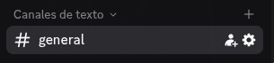
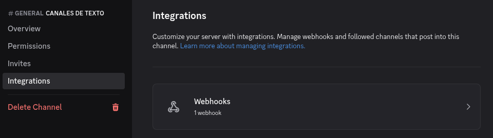
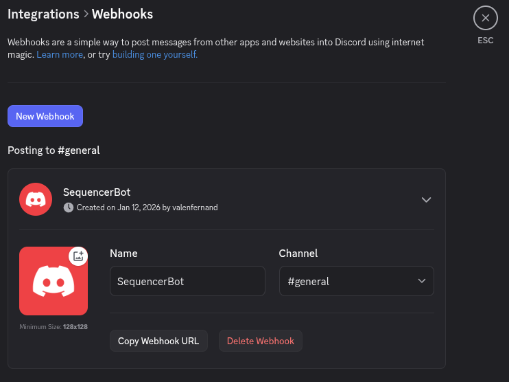
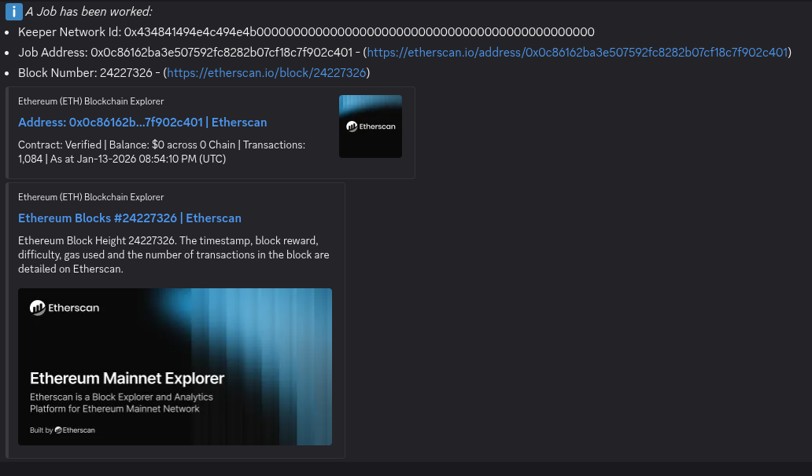
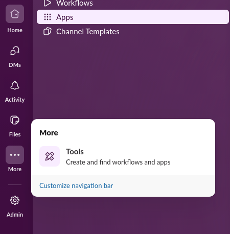
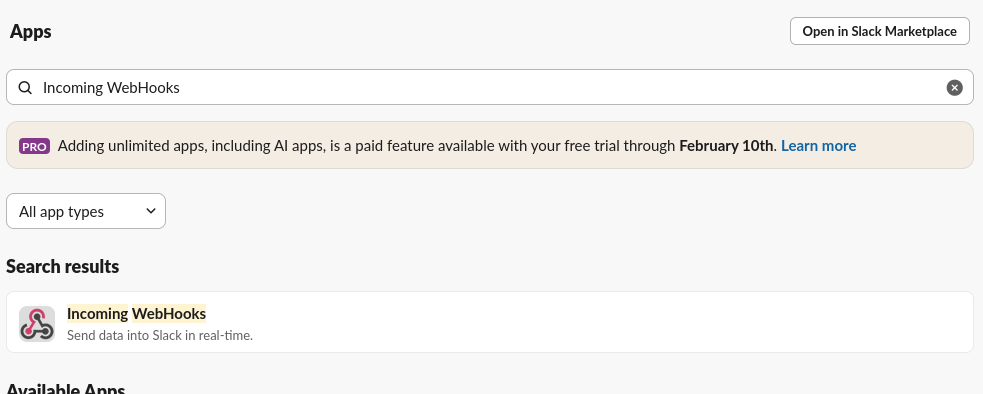
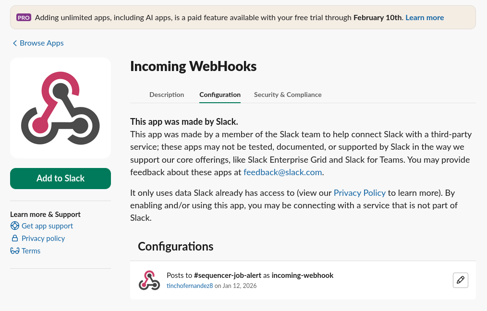
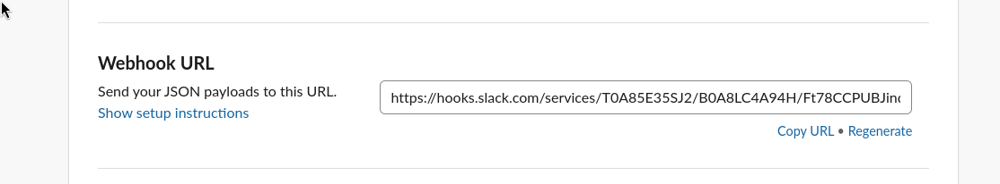
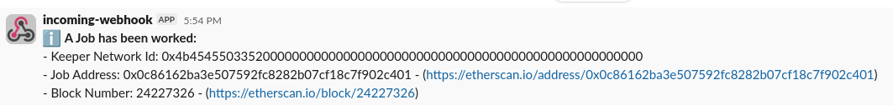

# Monitor Alerts

The Keeper Network Monitor uses third party Webhooks in order to send alerts to Discord and Slack. In this guide I will show you how to configure the services and obtain the Webhook URL from both services.

## Discord

Discord is very straight forward. You will need a Discord Server and a text channel in that server.

1. Click on the text channel settings.

    

2. Go to the Integrations Tab and click on Webhooks.

    

3. Click on New Webhook, after it is create it, expand it and you will be able to configure it and copy the WebHook URL. Add it to the `.env` under the `DISCORD_WEBHOOK` key.

    

4. When running the Monitor you should see messages from the WebHook when a job is worked.
   

## Slack

Now Slack requires a bit more setup. On your Slack Workspace

1. Go to the tools section and click on Apps.

    

2. Search for Incomming WebHooks and add it to your slack workspace.

    

3. Open the Incomming WebHooks App and go to configuration.

    

4. Copy the WebHook URL and add it to the `.env` config under the `SLACK_WEBHOOK` key.

    

5. When running the Monitor you should see messages from the WebHook when a job is worked.

    
