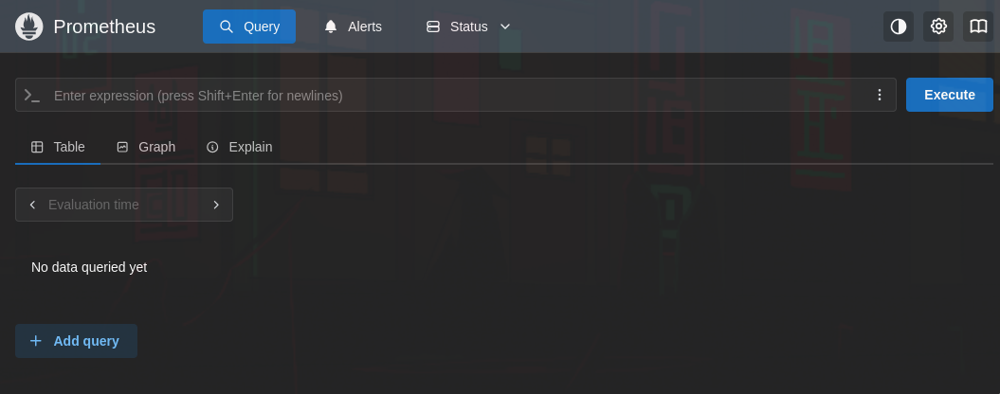
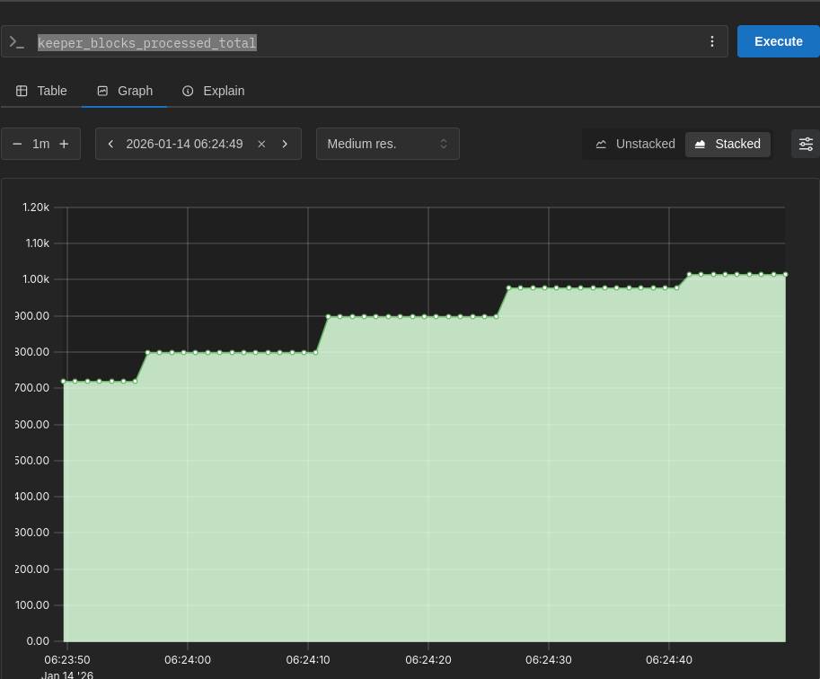
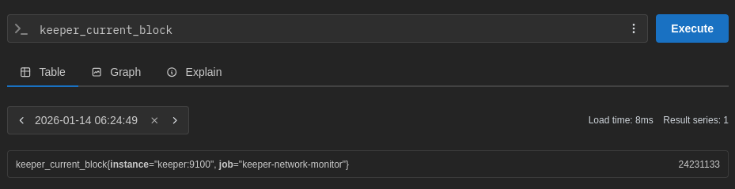
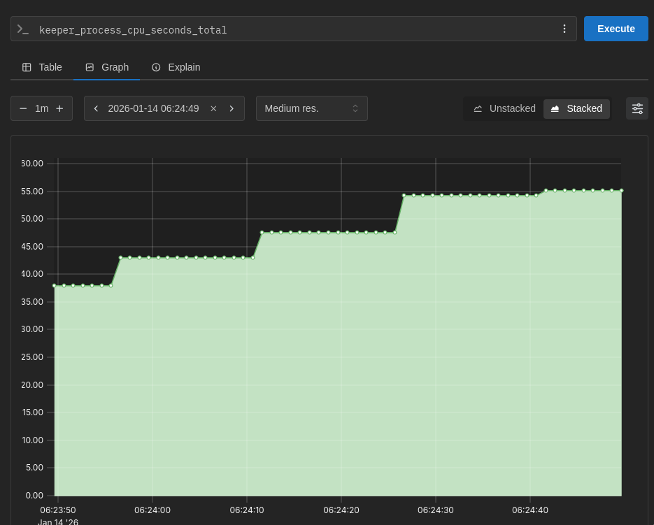

# Prometheus

When running this project with `docker-compose` it will spawn a [Prometheus](https://prometheus.io/) instance on port `9090`. If you head to [http://localhost:9090](http://localhost:9090) you will be greated with the Prometheus dashboard

You can use it different metrics that the service exposes, here are a few examples:

1. **Amount of total processed blocks**
   

2. **Current block beign analized**
   

3. **Amount of cpu used by the monitor**
   
